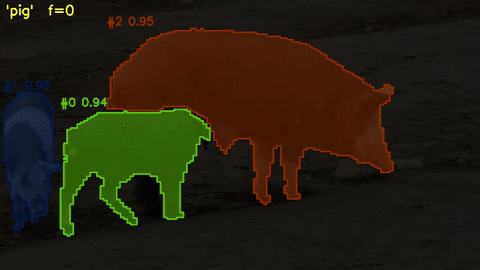
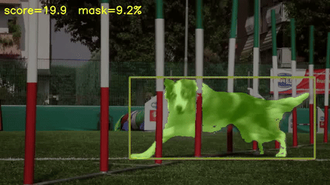

# SAM3 Video Tracker — ROCm / AMD

Open-vocabulary video tracking and segmentation built on [SAM3](https://github.com/facebookresearch/sam3),
optimized for AMD ROCm hardware. A **text prompt** like `"floor"` or `"person on a bike"`
finds the target on frame 0 (or every Nth keyframe in streaming mode); SAM3 propagates
the masks through subsequent frames.

**Primary path** — streaming live API (`demo_live.py`), the deployment shape used by ROS / robotics
consumers. Multi-prompt, hybrid keyframes + lightweight tracker propagation, ~5 FPS at 504px.

Reference paths:
- `tools/text_baseline.py` — offline batch text-prompt via HF `Sam3VideoModel` (debugging / regression)
- `demo_box.py` — specialized: bounding-box prompt, skips detection, **12.21 FPS** propagation (single-object benchmark / interactive UI)

DAVIS 2017 val Mean J: **81.6%** (504px box-prompt).

> **Hardware requirement**: AMD gfx1151 (Radeon 8060S / Ryzen AI Max+ 395) with ROCm 7.x.
> Other AMD GPUs supporting ROCm may work but are untested.

## Contents

- [How it works](#how-it-works)
- [Setup](#setup)
- [Run the demos](#run-the-demos)
- [Results](#results)
- [Performance](#performance)
- [Evaluation](#evaluation)
- [Project structure](#project-structure)
- [Known limitations](#known-limitations)
- [Acknowledgements](#acknowledgements)

---

## How it works

All three entry points share the same ViT backbone, SAM3 mask decoder, and SAM3
tracker propagation. They differ in **how the first-frame mask is obtained** and **whether
SAM3 detection re-runs after frame 0**:

```
demo_live.py             text → SAM3 keyframe (every N ms)  ──┐
                         └── propagate via SAM3 tracker ──────┴──► streaming mask output
tools/text_baseline.py   text → full SAM3 every frame          ──────► offline batch output
demo_box.py              [box] (frame 0 only)                  ──────► fastest, single-object
```

### Streaming live API (`demo_live.py`) — primary

The deployment shape used by robotics / ROS consumers. Frame 0 runs SAM3 detection
on the text prompts and captures exemplar boxes; subsequent frames run SAM3 only every
`--redetect-interval-ms` (default 1000ms), with a lightweight SAM3 tracker
propagating masks in between. Internally combines `SAM3Live` (per-frame HF
`Sam3VideoModel`) for keyframes and `SAM3OnnxTracker` for tracker propagation. Supports
multi-prompt, periodic re-bootstrap on drift / scene change, runtime prompt swap.

### Offline batch text-prompt (`tools/text_baseline.py`)

Uses HF `Sam3VideoModel` directly with a fixed video session. Slower than the streaming
path because SAM3 detection runs every frame, but it's the cleanest path against the
upstream HF API — useful for debugging the wrapper and as a regression baseline.

Pipeline: CLIP text encoder → ViT backbone → DETR encoder/decoder → SAM3 mask decoder
on frame 0; backbone + memory_attention + mask_decoder on frames 1+. All three heavy
modules (backbone, DETR encoder, memory attention) are MIG-accelerated.

### Specialized box-prompt (`demo_box.py`)

The user draws a bounding box on frame 0 — detection is skipped entirely. Uses
`SAM3OnnxTracker`: a single-object ONNX pipeline with MIGraphX-compiled modules. This
is the **fastest** path (12.21 FPS @504px) but specialized to one object and assumes
the user already knows where the target is.

### Shared propagation loop (frames 1+)

```
pixel_values ──► backbone.mxr ──► memory_attention (ORT MIG EP) ──► mask_decoder ──► mask
                                          ▲
                              memory bank (7 spatial frames + object pointers)
```

---

## Setup

### Prerequisites

Have these in place **before** running `./setup.sh`:

| Requirement | Handled by | Notes |
|---|---|---|
| Hardware: AMD Ryzen AI Max+ 395 (gfx1151) | You | Other ROCm-capable AMD GPUs may work but are untested |
| OS: Ubuntu 24.04.4 LTS | You | Other Linux distros with ROCm 7.x support may work |
| Kernel: 6.8+ (tested: 6.18.6) | You | Required for gfx1151 AMDGPU driver support |
| **conda / miniforge** (any recent) | ⚠️ You — install before running setup.sh | `setup.sh` errors out if conda is not found. [Install miniforge](https://github.com/conda-forge/miniforge) |
| **BIOS UMA Frame Buffer Size = 64 GB** | ⚠️ You — set in BIOS | **128 GB systems only** — without this, backbone OOMs at 1008px. See [Finding #7](docs/project_summary.md). |
| **System ROCm 7.2 APT** (`migraphx 2.15.0`) | ✅ setup.sh step 0a | Installs automatically; skip with `--skip-apt` if already done |

> **Why two ROCm stacks?** AMD currently ships gfx1151 PyTorch support only in nightly
> pip wheels (ROCm 7.13), while MIGraphX is only in the stable APT release (ROCm 7.2).
> Both are required; `setup.sh` installs them in the right order.

### Stage 1 — Environment (`./setup.sh`, ~10 min)

```bash
git clone https://github.com/harrysocool/sam3-tracker-rocm.git
cd sam3-tracker-rocm
./setup.sh
```

Useful flags: `--skip-apt`, `--skip-migraphx`, `--env NAME`.
See [setup.sh](setup.sh) for details.

What it does:
1. APT: ROCm 7.2 stack + stock MIGraphX 2.15.0 (`--skip-apt` to bypass)
2. Patched MIGraphX tarball (~2 min, two unreleased fixes for the headline FPS — `--skip-migraphx` to bypass)
3. Conda env (`sam3-tracker` by default; override with `--env`) with Python 3.12
4. ROCm 7.13 nightly SDK + PyTorch (gfx1151 wheels, ~2–5 min)
5. ONNX Runtime MIGraphX EP wheel (1.24.2)
6. Python dependencies from `requirements.txt`
7. Model weights from community mirror `1038lab/sam3` (no HF account needed)

### Stage 2 — Build model artefacts (`export/build.py`)

After `setup.sh`, activate the environment and build artefacts for the pipeline(s) you want:

```bash
conda activate sam3-tracker

# Text-prompt MIG — demo_live.py / tools/text_baseline.py --mig  (~18 min @504px)
python export/build.py --pipeline text --imgsz 504

# Box-prompt only — demo_box.py  (~10 min @504px)
python export/build.py --pipeline box --imgsz 504

# Both pipelines at 504px (recommended)
python export/build.py --pipeline all --imgsz 504
```

Each step skips if output already exists — safe to re-run after interruption.
Use `--force` to rebuild from scratch.

<details>
<summary><b>1008px (higher mask quality, 3-10× slower)</b></summary>

1008px is supported as an advanced option but isn't the recommended path. Build with:

```bash
python export/build.py --pipeline all --imgsz 1008
# or both resolutions in one run (~90 min total):
python export/build.py --pipeline all --imgsz 504 1008
```

Requires `BIOS UMA Frame Buffer Size = 64 GB` on 128 GB systems to avoid backbone OOM.

</details>

### Manual / alternative paths

<details>
<summary><b>Patched MIGraphX — build from source</b></summary>

The headline FPS requires two unreleased MIGraphX fixes (a `find_splits` patch +
NHWC output fix). `setup.sh` installs a prebuilt tarball; if you'd rather build:

| Path | FPS (504 / 1008 px) | What you need |
|---|---|---|
| Stock APT 2.15.0 | 5.72 / 1.35 | Checkout tag `v0.1-migraphx-2.15` |
| **Prebuilt tarball** (default) | **8.21 / 2.31** | `setup.sh` downloads + installs |
| Build from source | 8.21 / 2.31 | See [`docs/build_migraphx_patched.md`](docs/build_migraphx_patched.md) |

</details>

<details>
<summary><b>Model weights — download from official HF source</b></summary>

`setup.sh` pulls `1038lab/sam3` (community mirror, no account). To use the
official `facebook/sam3` repo instead (HuggingFace account + accepted terms
required), download manually before running `setup.sh`:

```bash
hf download facebook/sam3 model.safetensors --local-dir model/sam3
```

`setup.sh` skips the download step if `model/sam3/model.safetensors` already exists.

> `hf` is the new CLI in `huggingface_hub ≥ 1.0`. Older versions ship `huggingface-cli` (same arguments).

</details>

<details>
<summary><b>Step-by-step manual install (no setup.sh)</b></summary>

For full control over each step (APT, conda, pip, ONNX export, backbone compile)
see [`docs/manual_setup.md`](docs/manual_setup.md).

</details>

---

## Run the demos

Three entry points — pick the one matching your use case:

| Demo | Prompt | Pipeline | Steady-state FPS @504 | Use for |
|---|---|---|---|---|
| **`demo_live.py`** | text(s) | **Streaming hybrid** — SAM3 keyframe + tracker propagate | **~5 FPS multi-prompt** | production / ROS / live sensor |
| `tools/text_baseline.py --mig` | text | Offline HF Sam3VideoModel, SAM3 every frame | 5.5 (1 obj) / 4.4 (4 obj) | debugging / regression baseline |
| `demo_box.py` | bounding box | Tracking only (no detection) | **12.2** (single-object) | specialized: annotation / max-perf |

All commands below assume you have activated the conda env (`conda activate sam3-tracker`)
and are in the project root. The MIGraphX text-prompt path requires the `LD_PRELOAD` shown
in the commands below to resolve a dual-ROCm-version conflict; the box-prompt and PyTorch
text-prompt paths do not need it.

### Streaming live API (`demo_live.py`) — primary

The deployment shape used by robotics consumers. Reads frames from a video file (or
later, a ROS image topic — see `examples/ros_node_skeleton.py`) and emits a multi-prompt
mask per frame.

```bash
# Multi-prompt live (default: 1000ms keyframe interval, hybrid pipeline)
LD_PRELOAD=/opt/rocm-7.2.x/lib/libmigraphx_c.so.3:/opt/rocm-7.2.x/lib/migraphx/lib/libmigraphx.so.2016000.0 \
    python demo_live.py --checkpoint model/sam3 --onnx-dir onnx_files_504 \
    --video assets/office_hallway.mp4 --text floor wall --mig

# Single-prompt, baseline mode (SAM3 every frame — equivalent to old --hybrid off)
LD_PRELOAD=... python demo_live.py --checkpoint model/sam3 --onnx-dir onnx_files_504 \
    --video assets/blackswan.mp4 --text swan --mig --redetect-interval-ms 0
```

Key flags: `--redetect-interval-ms` (0 = SAM3 every frame; >0 = keyframe-every-N-ms +
tracker propagate); `--periodic-rebootstrap-seconds` (drift safety net, default 180s).
See `python demo_live.py --help` for the full set.

### Offline batch text-prompt (`tools/text_baseline.py`) — reference / debugging

> `assets/blackswan.mp4` is a bundled swan clip. Replace with your own video.
> MIG commands (`--mig`) require Stage 2 artefacts to be built first.

```bash
# Image — pure PyTorch path (no MIG artifacts needed)
python tools/text_baseline.py --checkpoint model/sam3 \
    --image assets/truck.jpg --text "truck"

# Video — pure PyTorch baseline
python tools/text_baseline.py --checkpoint model/sam3 \
    --video assets/blackswan.mp4 --text "swan" --max-frames 60

# Video — MIG @504 (~5.1 FPS, 10× over PT baseline, best for offline demos)
LD_PRELOAD=/opt/rocm-7.2.x/lib/libmigraphx_c.so.3:/opt/rocm-7.2.x/lib/migraphx/lib/libmigraphx.so.2016000.0 \
    python tools/text_baseline.py --checkpoint model/sam3 --onnx-dir onnx_files_504 \
    --video assets/blackswan.mp4 --text "swan" --imgsz 504 --mig --max-frames 60
```

**Multi-object flags** (text-prompt detection — `text_baseline.py` / `demo_live.py`):
- `--min-score 0.5` — only track detections above this confidence (default 0.5)
- `--max-objects 0` — cap by score rank, 0 = all above threshold (default 0 = all)

```bash
# Track every person above 0.4 confidence
python tools/text_baseline.py --checkpoint model/sam3 --onnx-dir onnx_files_504 \
    --video assets/two_person_dog_lawn.mp4 --text "person" \
    --imgsz 504 --mig --min-score 0.4

# Track at most 2 people (highest scoring)
python tools/text_baseline.py --checkpoint model/sam3 --onnx-dir onnx_files_504 \
    --video assets/two_person_dog_lawn.mp4 --text "person" \
    --imgsz 504 --mig --max-objects 2
```

<details>
<summary><b>1008px text-prompt (higher quality, ~1.5 FPS)</b></summary>

```bash
LD_PRELOAD=/opt/rocm-7.2.x/lib/libmigraphx_c.so.3:/opt/rocm-7.2.x/lib/migraphx/lib/libmigraphx.so.2016000.0 \
    python tools/text_baseline.py --checkpoint model/sam3 --onnx-dir onnx_files_1008 \
    --video assets/blackswan.mp4 --text "swan" --mig --max-frames 60
```

</details>

### Specialized box-prompt (`demo_box.py`)

> `assets/truck.jpg` and `assets/blackswan.mp4` are bundled demo files. Replace with
> your own image or video. `--box x1,y1,x2,y2` is the bounding box around the target on
> frame 0, in pixel coordinates.

```bash
# Image — MIGraphX backbone (default, ~115 ms / frame)
python demo_box.py --checkpoint model/sam3 --onnx-dir onnx_files_504 \
    --image assets/truck.jpg --box 85,281,1710,850

# Video (any mp4) — output written to outputs/box/<stem>_tracked.mp4
python demo_box.py --checkpoint model/sam3 --onnx-dir onnx_files_504 \
    --video assets/blackswan.mp4 --box 320,170,650,400
```

Outputs default to `outputs/{box,text}/<input-stem>_{tracked,text}.{jpg,mp4}` (overridable
with `--output`). Try short noun phrases: `"swan"`, `"a person on a bike"`, `"yellow taxi"`.

### Quick checks

```bash
conda activate sam3-tracker  # if not already active
```

| Script | Requires | What it checks | Time |
|---|---|---|---|
| `eval/probes/probe_text_prompt.py`     | Stage 1 only | Text-prompt detection (pure PyTorch) | ~10 s |
| `eval/benchmarks/bench_pipeline.py`    | Stage 2 box  | Per-module latency + total FPS       | ~30 s |
| `eval/probes/probe_text_prompt_mxr.py` | Stage 2 text | Text-prompt with MIGraphX backbone   | ~15 s |
| `eval/benchmarks/profile_text_prompt.py` | Stage 2 text | Per-stage latency of text-prompt   | ~30 s |

```bash
# After Stage 1 only:
python eval/probes/probe_text_prompt.py --checkpoint model/sam3 --image assets/truck.jpg --text "truck"

# After Stage 2 (box):
python eval/benchmarks/bench_pipeline.py --checkpoint model/sam3 --onnx-dir onnx_files_504

# After Stage 2 (text):
python eval/probes/probe_text_prompt_mxr.py --checkpoint model/sam3 --onnx-dir onnx_files_504 --image assets/truck.jpg --text "truck"
python eval/benchmarks/profile_text_prompt.py --checkpoint model/sam3 --image assets/truck.jpg --text "truck"
```

---

## Results

### Text-prompt: detection + tracking (`tools/text_baseline.py --mig --imgsz 504`)

| `"swan"` | `"camel"` | `"pig"` (3 objects) |
|:---:|:---:|:---:|
|  |  |  |

### Box-prompt: tracking only (`demo_box.py`)

| truck — single image | dog-agility — video |
|:---:|:---:|
|  |  |

---

## Performance

*All numbers measured on AMD Ryzen AI Max+ 395 (gfx1151) at 504px with MIG-accelerated
backbone + memory_attention + DETR encoder. To reproduce, see the [Evaluation](#evaluation)
section.*

### Text-prompt (`tools/text_baseline.py --mig` / `demo_live.py`)

| Path | Pipeline | Steady-state FPS |
|---|---|---|
| **`demo_live.py` (hybrid)** | SAM3 every 1000ms keyframe + tracker propagate between | **~5 FPS multi-prompt** |
| `tools/text_baseline.py --mig` | SAM3 every frame (offline batch) | 5.5 (1 obj) / 4.4 (4 obj) |
| `tools/text_baseline.py` (no MIG) | Pure PyTorch baseline | ~2.6 |

Mask quality: PT vs MIG mean IoU = **0.994** @504px (verified frame-by-frame on 20-30 frames).
Detection score: truck 0.95, swan 0.93-0.96.

Multi-object scaling @504 MIG (backbone shared across all objects):

| Objects tracked | tools/text_baseline.py prop FPS |
|---|---|
| 1 | 5.5 |
| 4 | ~4.4 |
| 8 (estimated) | ~2.9 |

### Box-prompt (`demo_box.py`) — specialized, fastest

| Backbone | DAVIS 2017 val J | Prop FPS |
|---|---|---|
| **MIGraphX 2.15+patches + MLIR** | **81.6%** | **12.21** |
| PyTorch ROCm FP16 | 81.6% | 5.72 |

> **Reference**: SAM2-L (official, GT first-frame mask) achieves **J&F=91.6%** on DAVIS 2017 val.
> Our box-prompt uses a box-derived mask on frame 0 instead of GT — the gap reflects prompt quality, not tracker propagation quality.

<details>
<summary><b>1008px numbers (higher quality, 3-10× slower)</b></summary>

| Demo | Resolution | DAVIS J | Prop FPS |
|---|---|---|---|
| `tools/text_baseline.py --mig` | 1008px | — | 1.5 |
| `tools/text_baseline.py` (no MIG) | 1008px | — | 0.52 |
| `demo_box.py` (MIG) | 1008px | 84.8% | 3.22 |
| `demo_box.py` (PyTorch) | 1008px | 84.8% | 1.35 |

Mask quality (text-prompt): PT vs MIG mean IoU = 0.999 @1008px.

1008px deep-dive: [`docs/historical/1008px_perf_analysis.md`](docs/historical/1008px_perf_analysis.md).

</details>


### Per-module latency breakdown (504px, MIGraphX backbone)

**Text-prompt propagation** (169 ms/frame → 5.9 FPS per-module sum; ~5.5 measured end-to-end, see table above) — MLIR attention backbone:

| Stage | Latency | Backend |
|---|---:|---|
| backbone (vision encoder) | ~97 ms | MIGraphX .mxr + MLIR attention ops (FP16) |
| memory_attention | ~20 ms | ORT MIGraphX EP FP16 ¹ |
| detr_encoder | ~11 ms | ORT MIGraphX EP FP16 |
| detr_decoder | ~11 ms | PyTorch |
| tracker_neck + mask_decoder + memory_encoder | ~8 ms | PyTorch |
| **Total propagation frame** | **~169 ms → 5.9 FPS** | |

**Box-prompt propagation** (~82 ms/frame → 12.21 FPS, with MLIR attention backbone):

| Stage | Latency | Backend |
|---|---:|---|
| backbone (`backbone_mxr_tuned.mxr`) | ~67 ms | MIGraphX 2.15+patches + MLIR attention (FP16) |
| memory_attention | ~7 ms | ORT MIGraphX EP FP16 ¹ |
| mask_decoder_propagate (`dec_prop_fp32.mxr`) | ~14 ms | MIGraphX direct API FP32 |
| memory_encoder (`mem_enc_fp32.mxr`) | ~2 ms | MIGraphX direct API FP16 |
| **Total propagation frame** | **~82 ms → 12.21 FPS** | |

¹ `memory_attention` and `detr_encoder` run through ONNX Runtime's MIGraphX EP rather than
a precompiled `.mxr` because the direct MIGraphX FP16 attention kernel produces NaN outputs
(analogous to [ROCm/AMDMIGraphX#3596](https://github.com/ROCm/AMDMIGraphX/issues/3596)).
The ORT EP path uses a different FP16 quantization path that produces correct results.

### Backbone speed comparison (504px)

| Backbone | Latency | Speedup |
|---|---|---|
| MIGraphX 2.15+patches (autotuned) | **92 ms** | **1.5×** |
| PyTorch ROCm FP16 + TunableOp | 139 ms | baseline |
| MIGraphX 2.15.0 (stock, HF ONNX) | ~916 ms | 0.15× |

The 1.5× backbone speedup comes from two patches on top of MIGraphX 2.15:
1. A patch to `find_splits` ([AMDMIGraphX#4256](https://github.com/ROCm/AMDMIGraphX/issues/4256)) enabling fusion of the HF window-attention `Split` ops
2. Kernel autotuning (analogous to PyTorch TunableOp) selecting optimal GEMM kernels

Run `python eval/benchmarks/bench_pipeline.py --checkpoint model/sam3 --onnx-dir onnx_files_504` to reproduce.

*Measured on AMD Ryzen AI Max+ 395 (gfx1151).*

---

## Evaluation

### Download datasets

**DAVIS 2017 val** (semi-supervised, 480p):
```bash
# Download from the official DAVIS challenge site
wget https://data.vision.ee.ethz.ch/csergi/share/davis/DAVIS-2017-trainval-480p.zip
unzip DAVIS-2017-trainval-480p.zip -d dataset/
# Result: dataset/DAVIS/{Annotations,ImageSets,JPEGImages}/
```

> Official page: [davischallenge.org/davis2017/code.html](https://davischallenge.org/davis2017/code.html)

### Run evaluation

```bash
# DAVIS 2017 val (box-prompt)
python eval/datasets/eval_davis.py \
    --checkpoint model/sam3 \
    --onnx-dir onnx_files_504 \
    --davis dataset/DAVIS \
    --imgsz 504

# PT vs MIG mask regression check
python eval/datasets/mask_diff_pt_vs_mig.py \
    --checkpoint model/sam3 --video assets/blackswan.mp4 \
    --text "swan" --imgsz 504 --max-frames 30 \
    --out results/eval/mask_diff_504.json

# Pipeline latency benchmark (box-prompt)
python eval/benchmarks/bench_pipeline.py \
    --checkpoint model/sam3 \
    --onnx-dir onnx_files_504

# Per-module profile (text-prompt, full MIG stack)
python eval/benchmarks/profile_full_mig.py \
    --checkpoint model/sam3 --video assets/blackswan.mp4 \
    --text "swan" --imgsz 504 \
    --out results/profile_504_mig.json
```

---

## Project structure

```
sam3-tracker-rocm/
├── demo_live.py            # ← Streaming live API (primary entry point)
├── tools/text_baseline.py  # ← Offline batch text-prompt (reference / debugging)
├── demo_box.py             # ← Specialized box-prompt (max single-object FPS)
├── setup.sh                # ← One-command environment setup
├── tracker/                # Inference: SAM3Live, SAM3HybridLive, SAM3OnnxTracker, MIG shims
├── export/                 # ONNX export + .mxr compile (build.py = unified entry point)
├── eval/                   # Benchmarks, dataset evals, probes, debug tools
├── examples/               # ROS 2 node skeleton + integrator guide
├── docs/                   # Setup guide, technical report, images
├── model/sam3/             # Config + tokenizer (weights downloaded separately)
├── assets/                 # Bundled demo inputs
└── onnx_files_504/         # Generated, gitignored — 504px MIG artefacts (1008 also supported)
```

---

## Known limitations

| Limitation | Detail / workaround |
|---|---|
| **Backbone cold-start** | First `.mxr` compile takes ~3 min (504px) / ~9 min (1008px) with autotuning; then loads in ~3s. Pre-build once: `python export/build.py --pipeline box --imgsz 504`. |
| **Text-prompt: vision_encoder dominates** | 65% of prop time @504px (57% @1008px). Each frame does a GPU→CPU→GPU round-trip through the MIG bridge (~37 ms @1008px). GPU-resident MIG (HIP IPC) is the main remaining optimization target. |
| **Small modules don't gain from ORT MIG EP** | Under ~30 ms the CPU↔GPU round-trip ≥ PT runtime. `detr_decoder` (~11–25 ms) confirmed net-neutral; `mask_decoder` (~5 ms) / `memory_encoder` (~6 ms) too small to MIG-ize. |
| **MIG attention must use ORT MIG EP** | Direct `parse_onnx + quantize_fp16` on `memory_attention` / `detr_encoder` yields NaN ([AMDMIGraphX#3596](https://github.com/ROCm/AMDMIGraphX/issues/3596)); even FP32 has ~0.05 max-diff that breaks detection thresholds. ORT EP with `migraphx_fp16_enable=1` is correct. |
| **memory_attention K=64 cliff** | MIGraphX picks a 14× slower kernel at `num_object_pointer_tokens=64` (791 ms vs 55 ms at K≤32). Shim caps K=32 and truncates oldest pointers — invisible for continuous tracking; re-ID across long disappearances may degrade slightly. |
| **Box-prompt `dec_propagate` stays FP32** | ConvTranspose upsampling is numerically sensitive; keep it FP32 (`dec_prop_fp32.mxr`). All other modules run FP16. |
| **MIGraphX 2.15+patches required** | Stock 2.15.0 (ROCm 7.2 APT) runs the HF backbone in ~916 ms (6.6× slower) due to a `find_splits` fusion limit. See [analysis](analysis/migraphx_backbone_investigation.md). |
| **Dual LD_PRELOAD for text-prompt MIG** | torch ROCm nightly bundles its own HIP runtime; loading MIGraphX after torch corrupts `.mxr` deserialization. `LD_PRELOAD` forces `/opt/rocm-7.2.x` libs to load first. |

---

## Acknowledgements

- **SAM3**: [facebookresearch/sam3](https://github.com/facebookresearch/sam3) — model weights
  and architecture. Weights must be downloaded separately from
  [facebook/sam3](https://huggingface.co/facebook/sam3) on HuggingFace.
- **DART**: the `sam3_tracker_video` model class originates from the
  [DART](https://arxiv.org/abs/2603.11441) project's transformers fork, since merged
  into HuggingFace Transformers (≥ 5.7.0).
