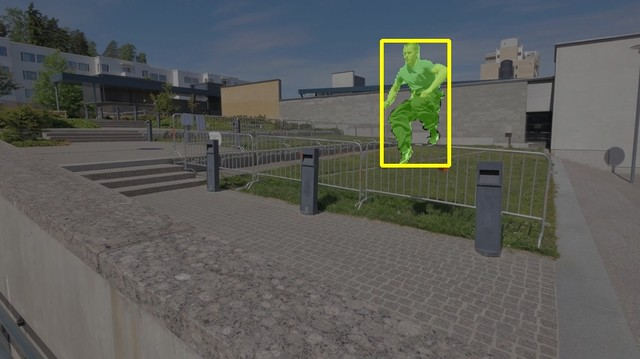
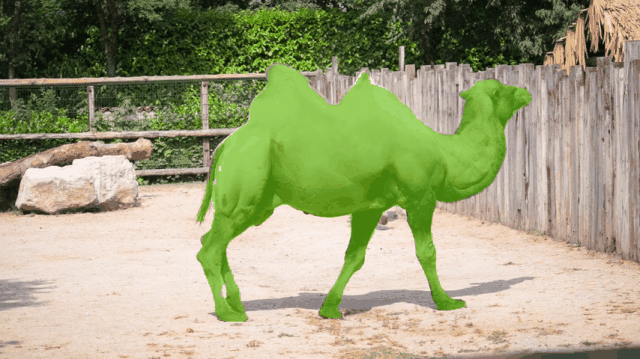

# SAM3 Video Tracker — ROCm / AMD

Mask-level video tracking pipeline built on [SAM3](https://github.com/facebookresearch/sam3),
optimized for AMD ROCm hardware. Achieves **8.21 FPS** (propagation frame) on an
AMD Ryzen AI Max+ 395 with a DAVIS 2017 val Mean J of **81.5%** (504px).

> **Hardware requirement**: AMD gfx1151 (Radeon 8060S / Ryzen AI Max+ 395) with ROCm 7.x.
> Other AMD GPUs supporting ROCm may work but are untested.

## Contents

- [How it works](#how-it-works)
- [Setup](#setup)
- [Run the demo](#run-the-demo)
- [Text-prompt tracking](#text-prompt-tracking)
- [Results](#results)
- [Performance](#performance)
- [Evaluation](#evaluation)
- [Project structure](#project-structure)
- [Known limitations](#known-limitations)
- [Acknowledgements](#acknowledgements)

---

## How it works

- **Frame 0**: user provides a bounding box → `mask_decoder_init.onnx` produces the initial mask
- **Frames 1+**: memory bank drives `mask_decoder_propagate.onnx` — no prompt needed
- **Backbone** runs via MIGraphX 2.15+patches (ONNX, no PyTorch required); tracking modules run via ONNX Runtime / MIGraphX

```
Input frame
  → backbone_mxr_tuned.mxr  (MIGraphX 2.15+patches)
  → memory_attention        (ORT MIGraphX EP) ¹
  → dec_prop_fp32.mxr       (MIGraphX)
  → mem_enc_fp32.mxr        (MIGraphX)
  ─────────────────────────────────────────────
  Total propagation frame: 8.21 FPS @ 504px (per-module timings: see Performance)
```

¹ `memory_attention` runs through ONNX Runtime's MIGraphX EP rather than a
precompiled `.mxr` because the direct MIGraphX FP16 attention kernel has a
numerical bug that breaks tracking (DAVIS J drops to ~2%). See
[ROCm/AMDMIGraphX#3596](https://github.com/ROCm/AMDMIGraphX/issues/3596).
The ORT EP path costs ~16 ms/frame vs the direct API (≈13% FPS) — mostly
host↔device transfer overhead, not the kernel itself. Recovering it is a known
optimization opportunity.

---

## Setup

### Quick start (one command)

```bash
./setup.sh
```

This script wraps everything: conda env, ROCm SDK, onnxruntime-migraphx, patched
MIGraphX install, ONNX export, backbone compile, and a smoke test.

Useful flags: `--skip-apt`, `--skip-migraphx`, `--env NAME`, `--imgsz 1008`.
See [setup.sh](setup.sh) for details.

### Prerequisites

| Requirement | Tested version | Notes |
|---|---|---|
| Hardware | AMD Ryzen AI Max+ 395 (gfx1151) | Other ROCm-capable AMD GPUs may work but are untested |
| OS | Ubuntu 24.04.4 LTS | Other Linux distros with ROCm 7.x support may work |
| Kernel | 6.8+ (tested: 6.18.6) | Required for gfx1151 AMDGPU driver support |
| **System ROCm 7.2 APT** | `migraphx 2.15.0` | `sudo apt install migraphx` (ROCm 7.2 repo) |
| conda / miniforge | any recent | |
| **BIOS UMA Frame Buffer Size** | **64 GB** | **Required on 128 GB systems** — without this, backbone OOMs at 1008px. See [Finding #7](docs/project_summary.md). |

> **Why two ROCm stacks?** AMD currently ships gfx1151 PyTorch support only in nightly
> pip wheels (ROCm 7.13), while MIGraphX is only in the stable APT release (ROCm 7.2).
> Both are required; `setup.sh` installs them in the right order.

### Patched MIGraphX (for full performance)

The headline FPS numbers require two unreleased MIGraphX fixes. `setup.sh` handles
the download and install automatically (`--skip-migraphx` if already done).

| Path | FPS (504 / 1008 px) | What you need |
|---|---|---|
| Stock APT 2.15.0 | 5.72 / 1.35 | Checkout tag `v0.1-migraphx-2.15` |
| **Prebuilt tarball** (recommended) | **8.21 / 2.31** | `setup.sh` downloads + installs (~2 min) |
| Build from source | 8.21 / 2.31 | See [`docs/build_migraphx_patched.md`](docs/build_migraphx_patched.md) |

### Model weights

Config and tokenizer files are already in this repo. Download `model.safetensors` (~3.3 GB):

```bash
# Option A — Official (HuggingFace account + accepted terms required):
huggingface-cli download facebook/sam3 model.safetensors --local-dir model/sam3

# Option B — Community mirror (no account needed):
huggingface-cli download 1038lab/sam3 sam3.safetensors --local-dir model/sam3
mv model/sam3/sam3.safetensors model/sam3/model.safetensors
```

> For step-by-step manual install (APT, conda, pip, ONNX export, backbone compile)
> see [`docs/manual_setup.md`](docs/manual_setup.md).

---

## Run the demo

The MIGraphX backbone needs `/opt/rocm-7.2.0/lib` on `PYTHONPATH` to find the
patched MIGraphX 2.15 Python bindings (the PyTorch backbone does not):

```bash
export PYTHONPATH=/opt/rocm-7.2.0/lib:$PYTHONPATH

# MIGraphX backbone (default, fastest)
python demo.py \
    --checkpoint model/sam3 \
    --onnx-dir onnx_files \
    --backbone migraphx \
    --image assets/demo.jpg \
    --box 85,281,1710,850

# PyTorch backbone (fallback if .mxr not yet compiled — no PYTHONPATH needed)
python demo.py \
    --checkpoint model/sam3 \
    --onnx-dir onnx_files \
    --backbone pytorch \
    --image assets/demo.jpg \
    --box 85,281,1710,850
```

---

## Text-prompt tracking

In addition to bounding-box prompts, SAM3 supports **open-vocabulary text prompts** —
describe the object in plain language and the model finds and tracks it. Frame 0 is
detected by `Sam3VideoModel` (PyTorch backbone + CLIP text encoder); all subsequent
frames run the same MIGraphX pipeline as box-prompt tracking (8.21 FPS @ 504px).

Text prompts are open-vocabulary short noun phrases. Examples that work well:
`"swan"`, `"bicycle"`, `"person on a bike"`. Negative (absent) concepts correctly
return zero detections.

### Requirements

Text-prompt tracking requires **PyTorch ROCm** and **HuggingFace Transformers ≥ 5.7.0**
with `Sam3VideoModel` support:

```bash
pip install "transformers>=5.8.0"
```

If `Sam3VideoModel` is not yet in your installed transformers version, add the
[DART transformers fork](https://arxiv.org/abs/2603.11441) to your Python path:
```bash
# Clone the DART repo, then:
export PYTHONPATH=/path/to/DART/.local_deps:$PYTHONPATH
```

See [`eval/probe_text_prompt.py`](eval/probe_text_prompt.py) for a complete runnable
example (text prompt → detection → mask, with visualisation).

### Performance

| Step | Latency | Note |
|---|---|---|
| Text detection (frame 0, warm) | ~1.6 s | PyTorch backbone + CLIP + DETR head |
| Propagation (frames 1+) | ~115 ms → **8.21 FPS** | Same MIGraphX pipeline as box-prompt |

The detection step runs once per video.

---

## Results

### Single-image segmentation (box prompt)

| truck (demo) | drift-straight (J = 95.2%) | parkour (J = 92.2%) |
|:---:|:---:|:---:|
|  |  |  |

### Video tracking (DAVIS 2017 val, 504px)

| blackswan  (J = 93.0%) | dog  (J = 94.7%) | camel  (J = 96.0%) |
|:---:|:---:|:---:|
|  |  |  |

---

## Performance

*To reproduce the accuracy numbers below, see the [Evaluation](#evaluation) section.*

### Video tracking (propagation FPS)

| Resolution | DAVIS 2017 val J | SG val J (50 seqs) ¹ | Propagation FPS | Backbone |
|---|---|---|---|---|
| **504px** | **81.5%** | **40.4%** | **8.21** | MIGraphX 2.15+patches |
| 1008px | 84.8% | 44.0% | **2.31** | MIGraphX 2.15+patches |
| 504px (PyTorch) | 81.5% | 40.4% | 5.72 | PyTorch ROCm FP16 |
| 1008px (PyTorch) | 84.8% | 44.0% | 1.35 | PyTorch ROCm FP16 |

*MIGraphX backbone uses `backbone_mxr_tuned.mxr` (pre-compiled with kernel autotuning).
PyTorch baseline uses TunableOp-autotuned GEMM kernels.*

¹ SG J (IoU) is a proxy metric on a random 50-sequence subset, not the official cgF1/pHOTA
evaluation. Official SG evaluation pending (requires full 1686-annotation run with text prompts).

### Per-module latency breakdown (504px, MIGraphX backbone)

| Stage | Latency | Backend |
|---|---:|---|
| backbone (`backbone_mxr_tuned.mxr`) | ~92 ms | MIGraphX 2.15+patches GPU (FP16 internal) |
| memory_attention (ORT MIGraphX EP FP16) | ~7 ms | ORT MIGraphX EP (direct API has kernel bug) |
| mask_decoder_propagate (`dec_prop_fp32.mxr`) | ~14 ms | MIGraphX direct API FP32 |
| memory_encoder (`mem_enc_fp32.mxr`) | ~2 ms | MIGraphX direct API FP16 |
| **Total propagation frame** | **~115 ms → 8.21 FPS** | |

### Backbone speed comparison (504px)

| Backbone | Latency | Speedup |
|---|---|---|
| MIGraphX 2.15+patches (autotuned) | **92 ms** | **1.5×** |
| PyTorch ROCm FP16 + TunableOp | 139 ms | baseline |
| MIGraphX 2.15.0 (stock, HF ONNX) | ~916 ms | 0.15× |

The 1.5× backbone speedup comes from two patches on top of MIGraphX 2.15:
1. A patch to `find_splits` ([AMDMIGraphX#4256](https://github.com/ROCm/AMDMIGraphX/issues/4256)) enabling fusion of the HF window-attention `Split` ops
2. Kernel autotuning (analogous to PyTorch TunableOp) selecting optimal GEMM kernels

Run `python eval/bench_pipeline.py --checkpoint model/sam3 --onnx-dir onnx_files` to reproduce.

*Measured on AMD Ryzen AI Max+ 395 (gfx1151).*

---

## Evaluation

### Download datasets

**DAVIS 2017 val** (semi-supervised, 480p):
```bash
# Download from the official DAVIS challenge site
wget https://data.vision.ee.ethz.ch/csergi/share/davis/DAVIS-2017-trainval-480p.zip
unzip DAVIS-2017-trainval-480p.zip -d dataset/
# Result: dataset/DAVIS/{Annotations,ImageSets,JPEGImages}/
```

> Official page: [davischallenge.org/davis2017/code.html](https://davischallenge.org/davis2017/code.html)

**Smartglass SG val** (SA-Co/VEval) — public Roboflow mirror, no account needed:

```bash
mkdir -p dataset
wget https://sa-co.roboflow.com/veval/saco_sg.zip -P dataset/        # ~30 GB frames
wget https://sa-co.roboflow.com/veval/gt-annotations.zip -P dataset/ # ~117 MB annotations
unzip dataset/saco_sg.zip -d dataset/
unzip dataset/gt-annotations.zip -d dataset/gt-annotations/
# Result: dataset/saco_sg/JPEGImages_6fps/ and dataset/gt-annotations/annotation/saco_veval_smartglasses_val.json
```

> Currently only the **SG (SmartGlasses)** subset is set up. The full SA-Co/VEval
> bundle also includes **SAV** and **YT1B** subsets but is significantly larger;
> evaluating on those is a future TODO.
>
> Also available (gated) on HuggingFace: [facebook/SACo-VEval](https://huggingface.co/datasets/facebook/SACo-VEval). Full mirror bundle (all subsets): [sa-co.roboflow.com/veval/all.zip](https://sa-co.roboflow.com/veval/all.zip).

### Run evaluation

```bash
# DAVIS 2017 val
python eval/eval_davis.py \
    --checkpoint model/sam3 \
    --onnx-dir onnx_files \
    --davis dataset/DAVIS \
    --imgsz 504

# Smartglass SG val
python eval/eval_saco_sg.py \
    --checkpoint model/sam3 \
    --onnx-dir onnx_files \
    --gt-json dataset/gt-annotations/saco_veval_smartglasses_val.json \
    --img-root dataset/saco_sg/JPEGImages_6fps \
    --imgsz 504

# Pipeline A vs B latency benchmark
python eval/bench_pipeline.py \
    --checkpoint model/sam3 \
    --onnx-dir onnx_files
```

---

## Project structure

```
sam3-tracker-rocm/
├── tracker/            # SAM3OnnxTracker — propagation pipeline
├── export/             # ONNX export + .mxr compile + ORT cache prewarm
├── eval/               # DAVIS / SG evaluation, benchmarks, probes
├── analysis/           # optimization deep-dives (markdown)
├── tools/              # patched MIGraphX install helper
├── docs/               # setup guide, technical report
├── model/sam3/         # config + tokenizer (weights downloaded separately)
├── onnx_files/         # generated, gitignored — 504px ONNX modules
├── onnx_files_1008/    # generated, gitignored — 1008px ONNX modules
├── results/            # eval outputs (json, plots)
├── dataset/            # downloaded datasets (DAVIS, saco_sg)
├── demo.py             # ← entry point: single image / video demo
├── setup.sh            # ← entry point: one-command setup
└── environment.yml
```

---

## Known limitations

- **MIGraphX backbone cold-start**: first compile of `backbone_mxr_tuned.mxr` takes
  ~3 min (504px) or ~9 min (1008px) with kernel autotuning. Subsequent runs load in ~3s.
  Run `export/export_backbone_single.py` once per resolution to pre-build the cache.
- **MIGraphX memory_attention cold-start**: first run JIT-compiles
  `memory_attention_fixed_N7.onnx` (~6s at 504px). Subsequent runs use the ORT cache.
- **`dec_propagate` FP16 corrupts results**: ConvTranspose upsampling is numerically
  sensitive — keep it at FP32 (`dec_prop_fp32.mxr`). All other modules run FP16.
- **MIGraphX 2.15+patches required**: the stock MIGraphX 2.15.0 from the ROCm 7.2
  APT package produces ~916ms for the HF backbone (6.6× slower) due to a fusion
  limitation in `find_splits`. See [`analysis/migraphx_backbone_investigation.md`](analysis/migraphx_backbone_investigation.md) for details.

---

## Acknowledgements

- **SAM3**: [facebookresearch/sam3](https://github.com/facebookresearch/sam3) — model weights
  and architecture. Weights must be downloaded separately from
  [facebook/sam3](https://huggingface.co/facebook/sam3) on HuggingFace.
- **DART**: the `sam3_tracker_video` model class originates from the
  [DART](https://arxiv.org/abs/2603.11441) project's transformers fork, since merged
  into HuggingFace Transformers (≥ 5.7.0).
