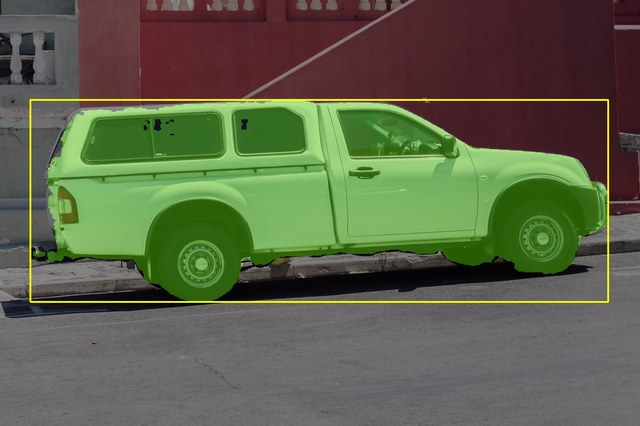
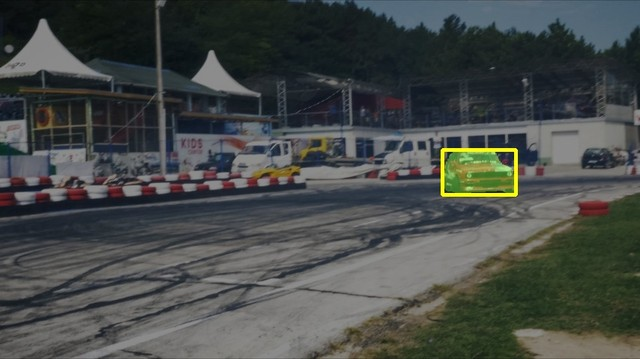
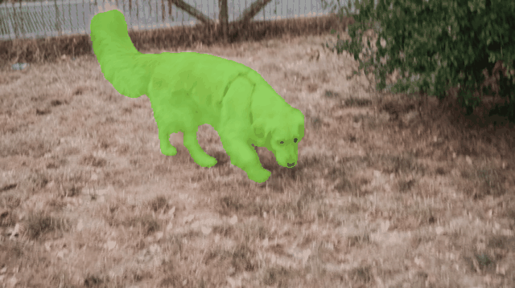

# SAM3 Video Tracker — ROCm / AMD

Mask-level video tracking pipeline built on [SAM3](https://github.com/facebookresearch/sam3),
optimized for AMD ROCm hardware. Achieves **9.46 FPS** (propagation frame) on an
AMD Ryzen AI Max+ 395 with a DAVIS 2017 val Mean J of **81.1%** (504px).

> **Hardware requirement**: AMD gfx1151 (Radeon 8060S / Ryzen AI Max+ 395) with ROCm 7.x.
> Other AMD GPUs supporting ROCm may work but are untested.

---

## How it works

- **Frame 0**: user provides a bounding box → `mask_decoder_init.onnx` produces the initial mask
- **Frames 1+**: memory bank drives `mask_decoder_propagate.onnx` — no prompt needed
- **Backbone** runs via MIGraphX 2.15+patches (ONNX, no PyTorch required); tracking modules run via ONNX Runtime

```
Input frame
  → backbone_mxr_tuned.mxr (MIGraphX 2.15+patches)   ~95ms
  → memory_attention_fixed_N7.onnx (MIGraphX)   ~7ms
  → mask_decoder_propagate.onnx (MIGraphX)       ~2ms
  → memory_encoder.onnx (MIGraphX)               ~1ms
  ─────────────────────────────────────────────────
  Total propagation frame: ~106ms → 9.46 FPS
```

<details>
<summary>Previous PyTorch backbone pipeline (for reference)</summary>

```
Input frame
  → PyTorch backbone (ROCm GPU FP16)          ~139ms
  → memory_attention_fixed_N7.onnx (MIGraphX)  ~16ms
  → mask_decoder_propagate.onnx (CPU ONNX)      ~7ms
  → memory_encoder.onnx (CPU ONNX)             ~11ms
  ─────────────────────────────────────────────────
  Total propagation frame: ~175ms → 5.72 FPS
```

</details>

## Text-prompt tracking

In addition to bounding-box prompts, SAM3 supports **open-vocabulary text prompts** —
describe the object in plain language and the model finds and tracks it.

```
Text: "swan"
  → Sam3VideoModel detector (PyTorch backbone + CLIP text encoder)
       → detection mask on frame 0
  → memory bank → propagation frames (same 9.46 FPS pipeline)
```

### How it works

1. **Frame 0 (init)**: `Sam3VideoModel` runs a CLIP-powered detector on the first frame,
   finding all instances matching the text description. The highest-scoring detection
   seeds the memory bank.
2. **Frames 1+**: identical to the box-prompt pipeline — the MIGraphX tracker propagates
   the initial mask through subsequent frames with no further text processing.

Text prompts are open-vocabulary short noun phrases. Examples that work well:
`"swan"`, `"bicycle"`, `"person on a bike"`. Negative (absent) concepts correctly
return zero detections.

### Requirements

Text-prompt tracking requires **PyTorch ROCm** (used for the detection step on frame 0)
and **HuggingFace Transformers ≥ 5.7.0** with `Sam3VideoModel` support:

```bash
# DART transformers fork (included in this repo's .local_deps, or install from HuggingFace)
# Already installed if you followed Setup steps 1–3
pip install "transformers>=5.7.0"
```

Add the DART fork to your Python path (needed until SAM3 models are in mainline
Transformers):
```bash
export PYTHONPATH=/path/to/sam3/repo/DART/.local_deps:$PYTHONPATH
```

### Usage

```python
import torch
from transformers import Sam3VideoModel, AutoProcessor
from PIL import Image

processor = AutoProcessor.from_pretrained("model/sam3")
model = Sam3VideoModel.from_pretrained("model/sam3").cuda().half().eval()

# Init session with the first frame
frame = Image.open("frame_0000.jpg").convert("RGB")
session = processor.init_video_session(
    video=[frame], inference_device="cuda", dtype=torch.float16
)

# Add a text prompt — returns a prompt ID
processor.add_text_prompt(session, "swan")

# Detect + initialise tracker on frame 0
with torch.inference_mode():
    out = model(inference_session=session, frame_idx=0)

print("detected objects:", out.object_ids)
print("scores:", out.obj_id_to_score)
# out.obj_id_to_mask[obj_id] → float16 logit mask tensor; threshold at 0 for binary
```

For subsequent frames, call `model(inference_session=session, frame=next_frame_tensor)`
— the tracker propagates the initial mask exactly as in the box-prompt pipeline.

See [`eval/probe_text_prompt.py`](eval/probe_text_prompt.py) for a complete single-image
example with visualisation.

### Performance

| Step | Latency | Note |
|---|---|---|
| Text detection (frame 0, warm) | ~1.6 s | PyTorch backbone + CLIP + DETR head |
| Propagation (frames 1+) | ~106 ms → **9.46 FPS** | Same MIGraphX pipeline as box-prompt |

The detection step runs once per video. Propagation performance is identical to
the box-prompt pipeline.

---
## Setup

> **One-command setup**: run `./setup.sh` to automate all steps below
> (conda env, ROCm SDK, onnxruntime-migraphx, ONNX export, backbone compile, smoke test).
> Flags: `--skip-apt`, `--skip-migraphx`, `--env NAME`, `--imgsz 1008`.
> See [setup.sh](setup.sh) for details.

### Prerequisites

| Requirement | Tested version | Notes |
|---|---|---|
| Hardware | AMD Ryzen AI Max+ 395 (gfx1151) | Other ROCm-capable AMD GPUs may work but are untested |
| OS | Ubuntu 24.04.4 LTS | Other Linux distros with ROCm 7.x support may work |
| Kernel | 6.8+ (tested: 6.18.6) | Required for gfx1151 AMDGPU driver support |
| **System ROCm 7.2 APT** | `migraphx 2.15.0` | Required for MIGraphX — see note below |
| conda / miniforge | any recent | Used to create the Python environment |
| BIOS | UMA Frame Buffer Size = **64 GB** | On 128 GB systems; see [Finding #7](docs/project_summary.md) |

> **Why two ROCm stacks?** AMD currently maintains two parallel release tracks:
> the **stable APT release** (ROCm 7.2.x, includes MIGraphX) and the
> **nightly pip wheels** (ROCm 7.13, includes PyTorch for gfx1151, but no MIGraphX).
> gfx1151 support is only available in the nightly track, so both are required:
> the APT install provides MIGraphX; the pip install provides PyTorch.
> See [`docs/project_summary.md`](docs/project_summary.md) for details.

#### 0. Install system ROCm 7.2 APT packages (MIGraphX)

```bash
# Add AMD ROCm 7.2 APT repository
sudo apt-get update
sudo apt-get install -y wget gnupg
wget -qO - https://repo.radeon.com/rocm/rocm.gpg.key | \
    gpg --dearmor | sudo tee /etc/apt/keyrings/rocm.gpg > /dev/null
echo "deb [arch=amd64 signed-by=/etc/apt/keyrings/rocm.gpg] \
    https://repo.radeon.com/rocm/apt/7.2 noble main" | \
    sudo tee /etc/apt/sources.list.d/rocm.list

# Install MIGraphX
sudo apt-get update
sudo apt-get install -y migraphx
```

> **Important**: PyTorch for gfx1151 (ROCm 7.13) and `onnxruntime-migraphx`
> are **not on standard PyPI**. Install them from AMD's nightly wheel index
> and the GitHub release linked below. A plain `conda create` + the steps
> below is sufficient — no TheRock pre-built environment is required.

#### 0b. (Optional) Install patched MIGraphX for full performance

The headline FPS numbers (9.46 / 2.39 at 504 / 1008 px) require two
unreleased MIGraphX fixes (`find_splits` multi-arg + NHWC `offload_copy`).
We refer to the resulting build as **`MIGraphX 2.15+patches`**.

| Path | Performance | What you need |
|---|---|---|
| Stay on stock APT 2.15.0 | 5.72 / 1.35 FPS (504 / 1008 px) | Check out tag `v0.1-migraphx-2.15` |
| **Install prebuilt tarball** | **9.46 / 2.39 FPS** | ~2 min — download release asset, run install script |
| Build patched from source | 9.46 / 2.39 FPS | ~30 min — for non-`gfx1151` GPUs or different ROCm/Python |

Both prebuilt and source paths are documented in [`docs/build_migraphx_patched.md`](docs/build_migraphx_patched.md).
Patched source lives in the fork: [`harrysocool/AMDMIGraphX` branch `fix/offload-copy-contiguous-output`](https://github.com/harrysocool/AMDMIGraphX/tree/fix/offload-copy-contiguous-output) (both patches stacked).

### 1. Install ROCm SDK + PyTorch for gfx1151

AMD provides official nightly wheels for gfx1151 at:
**`https://rocm.nightlies.amd.com/v2/gfx1151/`**

```bash
# Create a fresh conda environment
conda create -n sam3-tracker python=3.12 -y
conda activate sam3-tracker

# Step 1a: Install ROCm runtime Python packages (pin to 20260411 for onnxruntime-migraphx compatibility)
pip install rocm "rocm-sdk-core==7.13.0a20260411" rocm-sdk-libraries-gfx1151 rocm-sdk-devel \
    --index-url https://rocm.nightlies.amd.com/v2/gfx1151/

# Step 1b: Install PyTorch matching the same ROCm build date
pip install "torch==2.12.0a0+rocm7.13.0a20260411" \
            "torchvision==0.27.0a0+rocm7.13.0a20260411" \
            triton \
    --index-url https://rocm.nightlies.amd.com/v2/gfx1151/
```

> **Why pin to `20260411`?** `onnxruntime-migraphx 1.24.2` was compiled against the
> ROCm SDK from that date. Mismatched ROCm versions (even a few days apart) can cause
> MIGraphX kernel compilation to crash at runtime.

Set the following environment variables (add to `~/.bashrc` or your run script):

```bash
export HSA_OVERRIDE_GFX_VERSION=11.5.1
export PYTORCH_ALLOC_CONF=expandable_segments:True,garbage_collection_threshold:0.8,max_split_size_mb:512
export MIGRAPHX_GPU_HIP_FLAGS="-Wno-error -Wno-lifetime-safety-intra-tu-suggestions"
```

> **BIOS tip (128 GB systems)**: set *UMA Frame Buffer Size* to **64 GB** in BIOS.
> This maximises the GPU's fast non-coherent memory pool. Setting it to 128 GB
> starves the OS and paradoxically reduces GPU bandwidth. See
> [`docs/project_summary.md`](docs/project_summary.md) Finding #7 for details.

Verify:
```bash
python -c "import torch; print(torch.__version__, torch.cuda.is_available())"
# Expected: 2.12.0a0+rocm7.13.0a20260411  True
```

### 2. Install onnxruntime-migraphx

The MIGraphX-enabled ONNX Runtime is provided by
[Looong01/onnxruntime-rocm-build](https://github.com/Looong01/onnxruntime-rocm-build).

```bash
pip install https://github.com/Looong01/onnxruntime-rocm-build/releases/download/v1.24.2/onnxruntime_migraphx-1.24.2-cp312-cp312-manylinux_2_34_x86_64.whl
```

### 3. Install remaining dependencies

```bash
# Install additional packages needed by this project
pip install -r requirements.txt
```

### 4. Download SAM3 model weights

```bash
huggingface-cli download facebook/sam3 --local-dir model/sam3
```

### 5. Export ONNX tracking modules (~5 minutes)

```bash
# 504px — recommended (7.10 FPS, DAVIS J=81.1%)
python export/export_tracker_modules.py --imgsz 504 --output-dir onnx_files

# 1008px — higher quality (2.39 FPS, DAVIS J=85.8%)
python export/export_tracker_modules.py --imgsz 1008 --output-dir onnx_files_1008
```

> `--fixed-slots 7` (default) also exports `memory_attention_fixed_N7.onnx` with static shapes.
> The tracker automatically picks this file and runs it on MIGraphX.

### 5b. Export and compile MIGraphX backbone (~10 minutes first time)

```bash
# Export backbone ONNX (single-session, simplified)
# Then compile to .mxr with kernel autotuning — saved once, loaded in ~3s afterwards

# 504px backbone
python export/export_backbone_single.py --imgsz 504 --output-dir onnx_files
# Creates: onnx_files/backbone_mxr_tuned.mxr  (~896 MB, one-time compile ~3 min)

# 1008px backbone
python export/export_backbone_single.py --imgsz 1008 --output-dir onnx_files_1008
# Creates: onnx_files_1008/backbone_mxr_tuned.mxr  (~920 MB, one-time compile ~9 min)
```

> The `.mxr` cache encodes kernel-autotuned GPU programs. After first compile the backbone
> loads in ~3s on subsequent runs. Pass `--backbone pytorch` to fall back to PyTorch.

### 6. Run the demo

```bash
# MIGraphX backbone (default, fastest)
python demo.py \
    --checkpoint model/sam3 \
    --onnx-dir onnx_files \
    --backbone migraphx \
    --image assets/demo.jpg \
    --box 85,281,1710,850

# PyTorch backbone (fallback if .mxr not yet compiled)
python demo.py \
    --checkpoint model/sam3 \
    --onnx-dir onnx_files \
    --backbone pytorch \
    --image assets/demo.jpg \
    --box 85,281,1710,850
```

---

## Results

### Single-image segmentation (box prompt)

| truck (demo) | drift-straight (J = 95.2%) | parkour (J = 92.2%) |
|:---:|:---:|:---:|
|  |  |  |

### Video tracking (DAVIS 2017 val, 504px)

| blackswan  (J = 93.0%) | dog  (J = 94.7%) | camel  (J = 96.0%) |
|:---:|:---:|:---:|
|  |  |  |

---

## Performance

### Video tracking (propagation FPS)

| Resolution | DAVIS 2017 val J | SG val J (50 seqs) | Propagation FPS | Backbone |
|---|---|---|---|---|
| **504px** | **81.1%** | **39.6%** ¹ | **9.46** | MIGraphX 2.15+patches |
| 1008px | 85.8% | 44.8% ¹ | **2.39** | MIGraphX 2.15+patches |
| 504px (PyTorch) | 81.1% | 39.6% ¹ | 5.72 | PyTorch ROCm FP16 |
| 1008px (PyTorch) | 85.8% | 44.8% ¹ | 1.35 | PyTorch ROCm FP16 |

*MIGraphX backbone uses `backbone_mxr_tuned.mxr` (pre-compiled with kernel autotuning).
PyTorch baseline uses TunableOp-autotuned GEMM kernels.*

¹ SG J (IoU) is a proxy metric on a random 50-sequence subset, not the official cgF1/pHOTA evaluation. See [`docs/project_summary.md`](docs/project_summary.md).

### Per-module latency breakdown (504px, MIGraphX backbone)

| Stage | Latency | Backend |
|---|---:|---|
| backbone (`backbone_mxr_tuned.mxr`) | ~92 ms | MIGraphX 2.15+patches GPU (FP16 internal) |
| memory_attention (`memory_attention_fp16.mxr`) | ~7 ms | MIGraphX direct API FP16 |
| mask_decoder_propagate (`dec_prop_fp32.mxr`) | ~14 ms | MIGraphX direct API FP32 |
| memory_encoder (`mem_enc_fp32.mxr`) | ~2 ms | MIGraphX direct API FP16 |
| **Total propagation frame** | **~106 ms → 9.46 FPS** | |

### Backbone speed comparison (504px)

| Backbone | Latency | Speedup |
|---|---|---|
| MIGraphX 2.15+patches (autotuned) | **94 ms** | **1.5×** |
| PyTorch ROCm FP16 + TunableOp | 139 ms | baseline |
| MIGraphX 2.15.0 (stock, HF ONNX) | ~916 ms | 0.15× |

The 1.5× backbone speedup comes from two patches on top of MIGraphX 2.15:
1. A patch to `find_splits` ([AMDMIGraphX#4256](https://github.com/ROCm/AMDMIGraphX/issues/4256)) enabling fusion of the HF window-attention `Split` ops
2. Kernel autotuning (analogous to PyTorch TunableOp) selecting optimal GEMM kernels

Run `python eval/bench_pipeline.py --checkpoint model/sam3 --onnx-dir onnx_files` to reproduce.

*Measured on AMD Ryzen AI Max+ 395 (gfx1151).*

---

## Evaluation

### Download datasets

**DAVIS 2017 val** (semi-supervised, 480p):
```bash
# Download from the official DAVIS challenge site
wget https://data.vision.ee.ethz.ch/csergi/share/davis/DAVIS-2017-trainval-480p.zip
unzip DAVIS-2017-trainval-480p.zip -d dataset/
# Result: dataset/DAVIS/{Annotations,ImageSets,JPEGImages}/
```

> Official page: [davischallenge.org/davis2017/code.html](https://davischallenge.org/davis2017/code.html)

**Smartglass SG val** (SA-Co/VEval, gated — requires HuggingFace account and agreeing to Meta's terms):
```bash
# Annotations
huggingface-cli download facebook/SACo-VEval \
    annotation/saco_veval_smartglasses_val.json \
    --repo-type dataset --local-dir dataset/gt-annotations/

# Video frames (~6 FPS)
huggingface-cli download facebook/SACo-VEval \
    media/saco_sg.tar.gz \
    --repo-type dataset --local-dir dataset/
tar -xzf dataset/media/saco_sg.tar.gz -C dataset/
# Result: dataset/saco_sg/JPEGImages_6fps/
```

> Dataset page: [huggingface.co/datasets/facebook/SACo-VEval](https://huggingface.co/datasets/facebook/SACo-VEval)

### Run evaluation

```bash
# DAVIS 2017 val
python eval/eval_davis.py \
    --checkpoint model/sam3 \
    --onnx-dir onnx_files \
    --davis dataset/DAVIS \
    --imgsz 504

# Smartglass SG val
python eval/eval_saco_sg.py \
    --checkpoint model/sam3 \
    --onnx-dir onnx_files \
    --gt-json dataset/gt-annotations/saco_veval_smartglasses_val.json \
    --img-root dataset/saco_sg/JPEGImages_6fps \
    --imgsz 504

# Pipeline A vs B latency benchmark
python eval/bench_pipeline.py \
    --checkpoint model/sam3 \
    --onnx-dir onnx_files
```

---

## Project structure

```
sam3-tracker-rocm/
├── tracker/
│   ├── tracker.py          # SAM3OnnxTracker class
│   └── __init__.py
├── export/
│   └── export_tracker_modules.py   # Generate ONNX files from model weights
├── eval/
│   ├── eval_davis.py               # DAVIS 2017 evaluation
│   ├── eval_saco_sg.py             # Smartglass SG evaluation
│   ├── bench_pipeline.py           # Pipeline A vs B latency benchmark
│   ├── visualize_correctness.py    # Mask overlay grid for DAVIS sequences
│   ├── probe_text_prompt.py        # SAM3 text-prompt probe (PyTorch)
│   └── profile_text_prompt.py      # Per-module timing profiler
├── analysis/                       # Detailed optimization deep-dives
│   ├── backbone_optimization.md
│   ├── module_optimization.md
│   ├── 1008px_perf_analysis.md
│   └── migraphx_backbone_investigation.md
├── tools/
│   └── install_migraphx_patched.sh # Install script for patched MIGraphX
├── demo.py                         # Single image / video demo
├── assets/demo.jpg                 # Sample image
├── docs/
│   ├── project_summary.md          # Technical report
│   └── build_migraphx_patched.md   # Patched MIGraphX build/install guide
└── environment.yml
```

---

## Known limitations

- **MIGraphX backbone cold-start**: first compile of `backbone_mxr_tuned.mxr` takes
  ~3 min (504px) or ~9 min (1008px) with kernel autotuning. Subsequent runs load in ~3s.
  Run `export/export_backbone_single.py` once per resolution to pre-build the cache.
- **MIGraphX memory_attention cold-start**: first run JIT-compiles
  `memory_attention_fixed_N7.onnx` (~6s at 504px). Subsequent runs use the ORT cache.
- **`dec_propagate` FP16 corrupts results**: ConvTranspose upsampling is numerically
  sensitive — keep it at FP32 (`dec_prop_fp32.mxr`). All other modules run FP16.
- **Backbone PYTHONPATH**: the MIGraphX backbone requires `/opt/rocm-7.2.0/lib` in
  `PYTHONPATH` to find the MIGraphX 2.15+patches Python bindings. This is set in
  the run scripts. The PyTorch backbone has no such requirement.
- **MIGraphX 2.15+patches required**: the stock MIGraphX 2.15.0 from the ROCm 7.2
  APT package produces ~916ms for the HF backbone (6.6× slower) due to a fusion
  limitation in `find_splits`. See [`analysis/migraphx_backbone_investigation.md`](analysis/migraphx_backbone_investigation.md) for details.

---

## Acknowledgements

- **SAM3**: [facebookresearch/sam3](https://github.com/facebookresearch/sam3) — model weights
  and architecture. Model weights must be downloaded separately from
  [facebook/sam3](https://huggingface.co/facebook/sam3) on HuggingFace.
- **DART**: the `sam3_tracker_video` model class used in this project originates from the
  [DART](https://arxiv.org/abs/2603.11441) project's custom transformers fork, and has since
  been merged into the official HuggingFace transformers library (≥ 5.7.0).
- **HuggingFace Transformers** ≥ 5.8.0 is required for `Sam3TrackerVideoModel`.
