# SAM3 Backbone Module Flow

```mermaid
flowchart TD
    classDef gpu  fill:#1a73e8,stroke:#0d47a1,color:#fff
    classDef npu  fill:#e65100,stroke:#bf360c,color:#fff
    classDef cpu  fill:#2e7d32,stroke:#1b5e20,color:#fff
    classDef io   fill:#37474f,stroke:#263238,color:#fff

    VIDEO["📹 Video Frame\nH×W×3 BGR"]:::io

    subgraph GPU1["GPU · PyTorch"]
        EMBED["backbone.embeddings\nResize → 504×504 → normalize\n14×14 patch embed + tiled pos enc\noutput: 1 × 1296 × 1024"]:::gpu
    end

    subgraph NPUSUB["NPU subprocess  —  bh_npu_backbone_bf16\n(32× ViT Block loop)"]
        LN1["LayerNorm\nxclbin: layernorm/S1296"]:::npu
        WPART["Window Partition\nblocks 0–23 → 576 tokens\nblocks 24–31 → 1296 tokens\n(global attention, no partition)"]:::cpu
        QKVP["QKV Projection\nxclbin: proj_mc/qkvproj_w  proj_mc/qkvproj_g"]:::npu
        ROPE["RoPE Encoding\nCPU · AVX-512"]:::cpu
        QKT["QKᵀ  (scores)\nxclbin: qkt_S576 / qkt_S1296"]:::npu
        SM["Softmax\nxclbin: sm_S576 / sm_S1296"]:::npu
        PV["PV  (weighted sum)\nxclbin: pv_S576 / pv_S1296"]:::npu
        WUNPART["Window Unpartition\n(blocks 0–23 only)"]:::cpu
        OPROJ["O-Projection\nxclbin: proj_mc/oproj_w  proj_mc/oproj_g"]:::npu
        RESID1["Residual Add\nCPU"]:::cpu
        LN2["LayerNorm\nxclbin: layernorm/S1296"]:::npu
        FFN1["FFN Linear 1  (×2 expand)\nxclbin: ffn_mc/ffn1_half"]:::npu
        GELU["GELU\nCPU · AVX-512"]:::cpu
        FFN2["FFN Linear 2  (project back)\nxclbin: ffn_mc/ffn2"]:::npu
        RESID2["Residual Add\nCPU"]:::cpu
    end

    subgraph GPU2["GPU · PyTorch"]
        NECK["backbone.neck\nFPN multi-scale pyramid\noutput: 4 × [B, 256, H, W]"]:::gpu
        FPN["FPN Features\n256×36×36\n256×18×18\n256×9×9\n256×5×5"]:::gpu
    end

    VIDEO  --> EMBED
    EMBED  --> LN1
    LN1    --> WPART
    WPART  --> QKVP --> ROPE --> QKT --> SM --> PV --> WUNPART --> OPROJ --> RESID1
    RESID1 --> LN2 --> FFN1 --> GELU --> FFN2 --> RESID2
    RESID2 -. "×32 blocks" .-> LN1
    RESID2 --> NECK --> FPN
```

## Notes

- **288 NPU dispatches per frame**: 9 xclbin kernels × 32 blocks
- **XRT dispatch overhead**: ~3.4 ms each → ~134 ms total overhead (dominant cost)
- **Subprocess boundary**: tokens sent via stdin, features returned via stdout (binary pipe, MAGIC `0x0000BF16`)
- **Window vs Global attention**: blocks 0–23 use local windows (S=576); blocks 24–31 attend over all 1296 tokens
- **BF16 accuracy**: cos = 0.989 vs PyTorch FP32 reference
