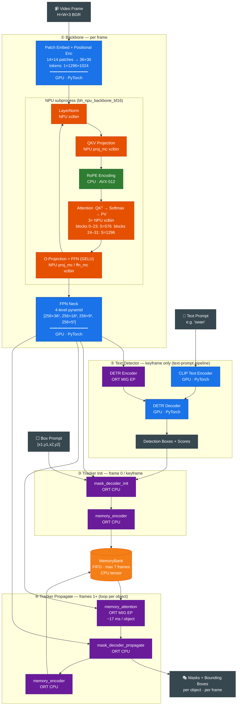

# SAM3 Module Flow

## Hardware Legend

| Color | Hardware | Modules |
|---|---|---|
| 🔵 Blue | **GPU · PyTorch** | Patch embed, FPN neck, CLIP encoder, DETR decoder |
| 🟠 Orange | **NPU BF16** | LayerNorm, QKV proj, Attention, FFN inside each ViT block |
| 🟢 Green | **CPU · AVX-512** | RoPE, GELU, residual add, FP32↔BF16 conversion |
| 🟣 Purple | **ORT MIG EP / CPU** | DETR encoder, memory_attention, mask_decoder_* |
| 🟡 Yellow | **CPU memory** | MemoryBank FIFO (up to 7 frames) |

## Pipeline Comparison

| | Box-prompt | Text-prompt |
|---|---|---|
| Frame 0 input | Manual box `[x1,y1,x2,y2]` | CLIP + DETR auto-detection |
| Backbone | MIGraphX GPU `.mxr` | NPU BF16 subprocess |
| Keyframe | None (frame 0 only) | Async NPU re-detection every ~3.5 s |
| Propagation | Identical ↑ | Identical ↑ |
